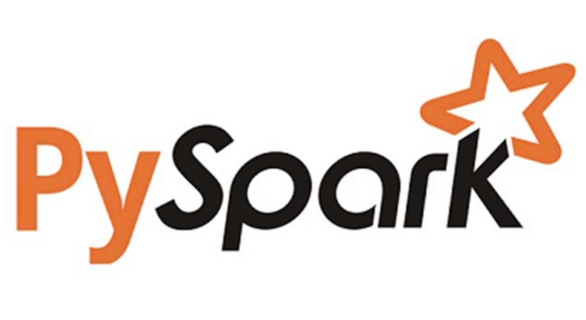

# Big Data with PySpark

In this repository I will start a series, based on Data Camp ['Big Data with PySpark'](https://app.datacamp.com/learn/skill-tracks/big-data-with-pyspark) course. I will reproduce the content seen in the course using Python and drawing conclusions from the data.

  

   

**Background in:** Mathematics, Python, Machine Learning and Applied Math.

**Links:**
* [LinkedIn](https://www.linkedin.com/in/joão-pedro-lavor-65162312b/)
* [Medium](https://jplavorr.medium.com/)

Aprimore as habilidades de dados dominando o Apache Spark. Usando a API Spark no Python, PySpark, você aproveitará a computação paralela com grandes conjuntos de dados e se preparará para o aprendizado de máquina de alto desempenho. Da limpeza de dados à criação de recursos e implementação de modelos de aprendizado de máquina, você executará fluxos de trabalho de ponta a ponta com o Spark. A faixa termina com a criação de um mecanismo de recomendação usando o popular conjunto de dados MovieLens e o conjunto de dados Million Songs.

## Projetos:

* **Introdução ao PySpark:** 
* **Limpando Dados com PySpark:** 

